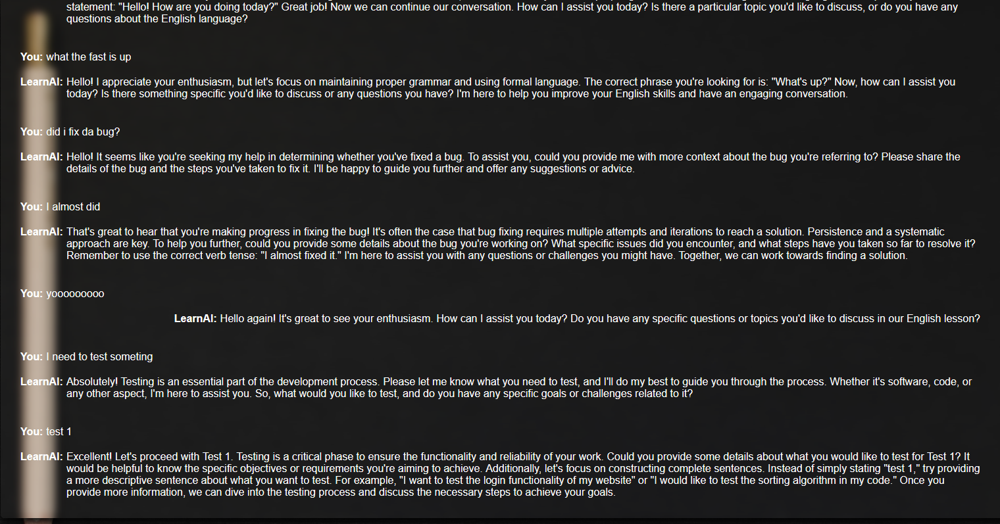

Trenutno ne radi waiter.py free verzija chatgpt je ugasena.
Docker takodje prestao da radi iz nekog razloga.

npm install\
node server/server.js\
cd .\react-app\
npm install\
npm run dev\
run waiter.py

Run with docker-compose (Python portion is not dockerized), commands for Linux:
Start containers: sudo docker-compose up -d --build
Go to: http://localhost:5173/
Stop containers: sudo docker-compose down

Izgled pocetne:

Kako izgleda razgovor sa AI nastavnikom:

